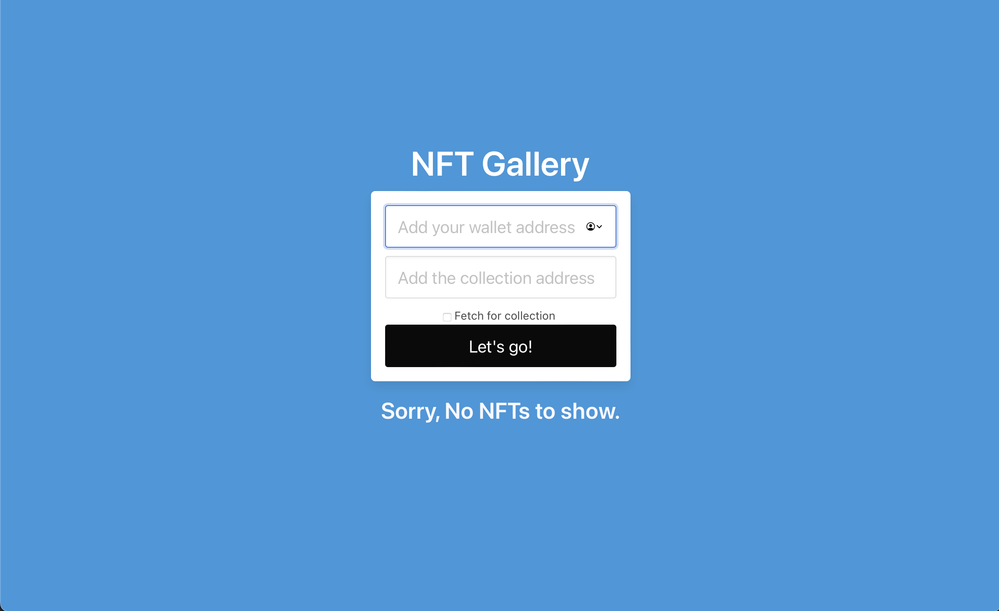
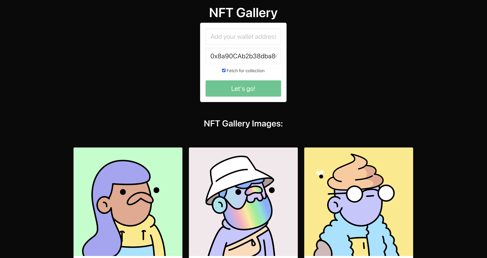

# NFTGallery Flask App

 - Get View NFTs in owner address
 - Get NFT collection
 - Get Owners NFTs in a Caollection

# Install

    git clone https://github.com/ephergent/nftgallery.git
    cd nftgallery
    virtualenv -p python3 venv
    source venv/bin/activate
    pip install -r requirements.txt

*[Note: See an example .env file below]*

    source .env

### Run it

    python app.py

Open `http://127.0.0.1:5000/` in browser of choice.

### Screenshots

#### Example .env file

    # Basic Flask stuff
    export FLASK_APP=app.py
    export FLASK_CONFIG=development
    export ALCHEMY_API_KEY=YOUR_ALCHEMY_API_KEY
    export SALTY_SECRET=bbq
    export CSRF_SESSION_KEY=hotdogs
    export SECRET_KEY=pizza
